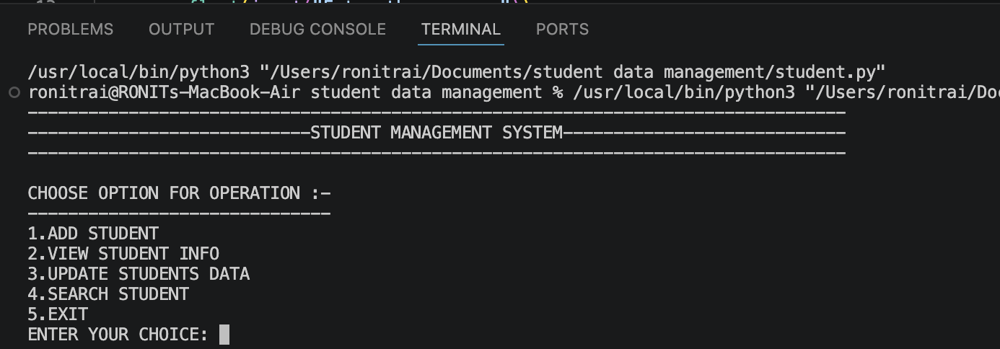
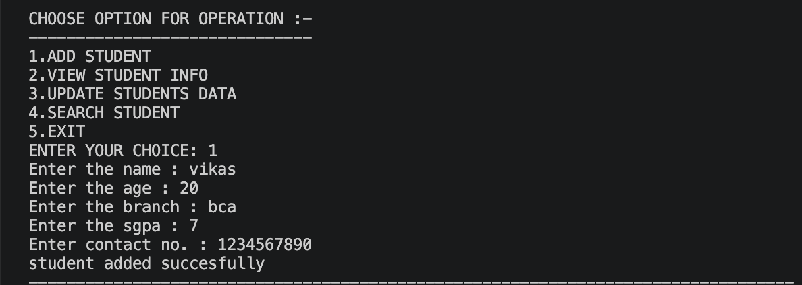
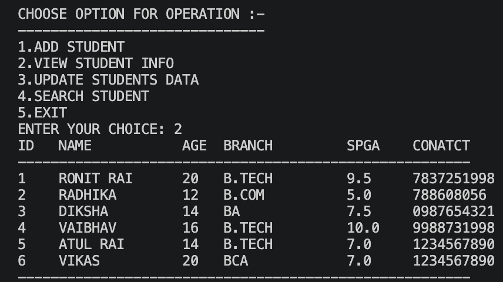
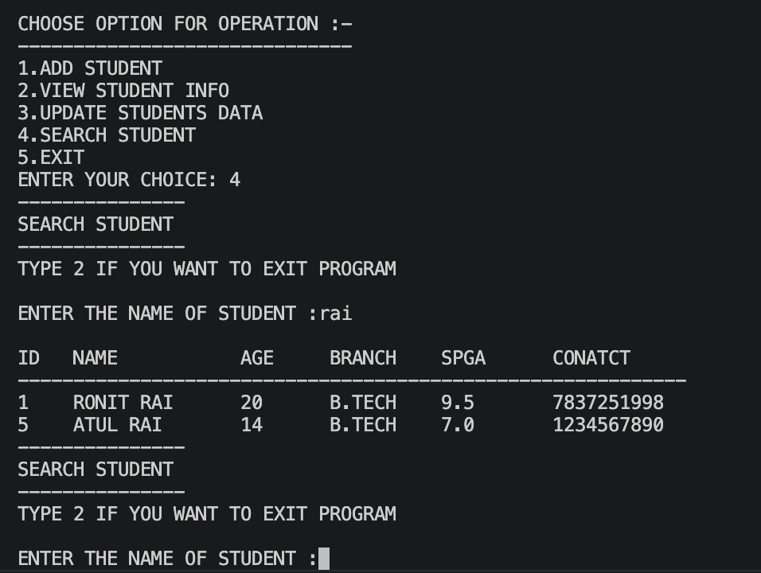
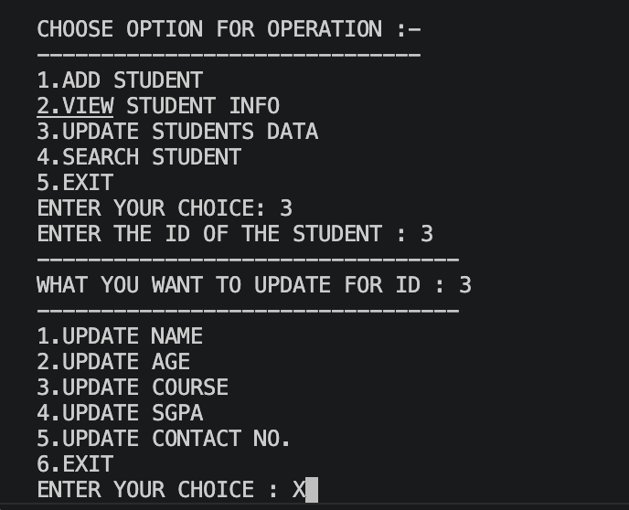

🎓 Student Management System
A simple Student Management System developed using Python and MySQL. The application provides a menu-driven interface for managing student records and demonstrates CRUD (Create, Read, Update, Delete) operations with database connectivity.
⸻
🚀 Features
✅ Completed

* Add Student
* View All Students
* Search Student by ID
* Update Student Details
* MySQL Database Connectivity
* Menu-driven Console Interface

🚧 In Progress

* Delete Student Record
* Input Validation
* Error Handling
* Improved Output Formatting

📌 Planned Features

* Search Student by Name
* Attendance Management
* Grade/CGPA Management
* Export Student Records
* Flask Web Interface (HTML & CSS)
* Authentication (Admin Login)

⸻

🛠️ Technologies Used

* Python 3
* MySQL
* mysql-connector-python
* VS Code
* Git & GitHub

⸻

📂 Database Schema

Table Name: RECORDS
Column	Type
ID	INT PRIMARY KEY AUTO_INCREMENT
NAME	VARCHAR(50)
AGE	INT
BRANCH	VARCHAR(50)
SGPA	INT
CONTACT	BIGINT
⸻
▶️ Current Menu

1. Add Student
2. View Students
3. Search Student
4. Update Student
5. Exit
⸻
⚙️ Setup
1. Clone the repository.
2. Install the required package:
pip install mysql-connector-python
3. Create the MySQL database and RECORDS table.
4. Update your MySQL username and password in the Python file.
5. Run the project:
python student.py
⸻
📈 Project Status
status: 🚧 Under Development

Completed
* Database Connection
* Add Student
* View Students
* Search Student
* Update Student

Remaining

* Delete Student
* Input Validation
* Better UI
* Flask Web Version
⸻
🎯 Future Improvements

* Responsive web interface using Flask, HTML, and CSS
* Dashboard for student statistics
* Search by multiple fields
* Export data to Excel/PDF
* User authentication

# Screenshots

## Main Menu

## Add Student

## View Students

## Search Student

## Update Student

⸻
📄 License

This project is created for educational and learning purposes.
the project complete
